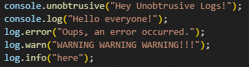
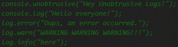

# unobtrusive-logs


[](https://codecov.io/gh/nemocazin/unobtrusive-logs)

## Description

VS Code extension that adjusts the visual appearance of log statements in your code by controlling their opacity and color, making them less obtrusive while coding.

Example:

<div style="text-align: left;">
  <figure style="display: inline-block; margin-right: 10px;">
    
    <figcaption><em>Before: Standard log appearance</em></figcaption>
  </figure>
  
  <figure style="display: inline-block;">
    
    <figcaption><em>After: Unobtrusive logs enabled</em></figcaption>
  </figure>
</div>

## Features

- Customizable opacity for log statements (0-100%)
- Configurable color for log statements
- Creation of custom regexes for log statements
- Support generic logs and languages specifics logs (more languages coming soon)
- Simple commands for quick adjustments

## Usage

The extension is enabled by default when you open VS Code. It will apply the configured opacity and color settings to log statements in your code.

### Commands

- `unobtrusive-logs.toggle`: Toggle On/Off the extension
- `unobtrusive-logs.changeOpacity`: Change the opacity level of log statements
- `unobtrusive-logs.changeColor`: Change the color of log statements
- `unobtrusive-logs.addCustomRegex`: Add a custom regex
- `unobtrusive-logs.deleteCustomRegex`: Delete a custom regex

### Configuration

You can configure the extension in VS Code settings:

- `unobtrusive-logs.toggle`: Activate or no the extension
- `unobtrusive-logs.opacity`: Opacity level for logs _(0 to 100, default: 50)_
- `unobtrusive-logs.color`: Color used for logs _(default: #808080)_
- `unobtrusive-logs.custom-regexes`: Custom regexes _({language: string, name: string, pattern: string})_

### Create a custom regex

If you want to implement your custom regex for specific statements, you need to use the command `unobtrusive-logs.addCustomRegex`.
Then they will ask to select a language, to name the regex and to write the regex formula.

Example:

```typescript
console\.help\(([\s\S]*?)\);?   // Regex for the following log statement
console.help("I need help for this regex !")
```

## Contact

[Némo Cazin](https://github.com/nemocazin) 2026
