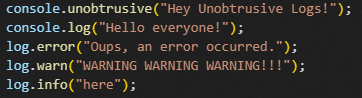
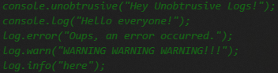

# unobtrusive-logs


[](https://codecov.io/gh/nemocazin/unobtrusive-logs)

## Description

VS Code extension that adjusts the visual appearance of log statements in your code by controlling their opacity and color, making them less obtrusive while coding.

<ins>Example:</ins>



_Before: Standard log appearance_



_After: Unobtrusive logs enabled_

## Features

- Customizable opacity for log statements (0-100%)
- Configurable color for log statements
- Creation of custom patterns for log statements
- Support generic logs and languages specifics logs (more languages coming soon)
- Simple commands for quick adjustments

## Usage

The extension is enabled by default when you open VS Code. It will apply the configured opacity and color settings to log statements in your code.

### Commands

- `unobtrusive-logs.changeOpacity`: Change the opacity level of log statements
- `unobtrusive-logs.changeColor`: Change the color of log statements
- `unobtrusive-logs.addCustomPattern`: Add a custom pattern
- `unobtrusive-logs.deleteCustomPattern`: Delete a custom pattern

### Configuration

You can configure the extension in VS Code settings:

- `unobtrusive-logs.opacity`: Opacity level for logs _(0 to 100, default: 50)_
- `unobtrusive-logs.color`: Color used for logs _(default: #808080)_
- `unobtrusive-logs.custom-patterns`: Custom patterns _({language: string, name: string, pattern: string})_

### Create a custom pattern

If you want to implement your custom pattern for specific statements, you need to use the command `unobtrusive-logs.addCustomPattern`.
Then they will ask to select a language, to name the pattern and to write the pattern formula.

Example:

```typescript
// Write <console.help> in the input of the addCustomPattern command
console.help('I need help for this pattern !'); // This sentence should be find
```

## Contact

[Némo Cazin](https://github.com/nemocazin) 2026
